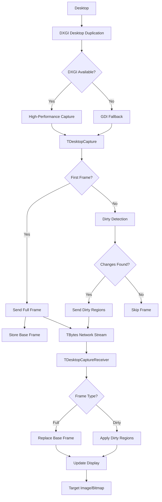

# 🖥️ Delphi_DesktopCapture
**Professional Desktop Duplication Components for Delphi with Network Streaming & Intelligent Dirty Pixel Detection**

<div align="center">


*High-performance DXGI-based desktop capture components with intelligent dirty pixel detection, network streaming capabilities, and automatic fallback to GDI*

</div>

---

## 🚀 Overview

Delphi_DesktopCapture provides two powerful, professional-grade desktop capture components built on Windows Desktop Duplication API (DXGI) with intelligent dirty pixel detection, automatic format optimization, network-ready TBytes streaming, and seamless GDI fallback. Perfect for remote desktop applications, screen sharing, surveillance software, live streaming, and real-time desktop monitoring.

### 🎯 What's Included

- **🖥️ TDesktopCapture Component** - Professional desktop duplication with intelligent dirty region detection
- **📺 TDesktopCaptureReceiver Component** - High-performance frame reconstruction and display
- **🔄 Smart Frame Management** - Full frame first, then dirty pixels only for maximum efficiency
- **🌐 Network-Ready Design** - TBytes-based callbacks for seamless network integration
- **🎯 Cursor Integration** - Optional cursor capture with proper alpha blending
- **📦 Ready-to-Install Package** - Complete component package for Delphi IDE
- **⚡ DXGI + GDI Fallback** - Maximum compatibility across all Windows versions

---

## 🏗️ Architecture



---

## ⭐ Key Features

### 🖥️ **TDesktopCapture Component**
- **DXGI Desktop Duplication** - Native Windows desktop duplication API for zero-copy capture
- **Intelligent Dirty Detection** - Advanced block-based algorithm detects only changed screen regions
- **Full Frame + Dirty Mode** - Sends complete screen first, then only pixel changes thereafter
- **Automatic GDI Fallback** - Seamless fallback to GDI on older systems or DXGI failures
- **High-Performance Threading** - Non-blocking capture with configurable frame rates
- **Network-Optimized Output** - TBytes format perfect for network transmission
- **Cursor Capture** - Optional high-quality cursor integration with alpha blending
- **Resolution Change Detection** - Automatic handling of display resolution changes

### 📺 **TDesktopCaptureReceiver Component**
- **Smart Frame Reconstruction** - Efficiently rebuilds full desktop from dirty regions
- **Base Frame Management** - Maintains complete desktop state for dirty region application
- **Display Integration** - Direct TImage component integration for easy UI development
- **Thread-Safe Operation** - Proper synchronization for multi-threaded network applications
- **Memory Efficient** - Intelligent buffer management prevents memory leaks
- **Error Resilient** - Graceful handling of corrupted or incomplete frame data

### 🎯 **Intelligent Dirty Detection**
- **Block-Based Analysis** - 32x32 pixel blocks for optimal performance vs. accuracy
- **Pixel Sampling** - Strategic pixel sampling reduces CPU usage while maintaining accuracy
- **Change Threshold** - Smart detection prevents false positives from minor variations
- **Region Optimization** - Coalesces adjacent dirty blocks into larger regions
- **Skip Empty Frames** - Automatically skips transmission when no changes detected

### 🛠️ **Technical Excellence**
- **Dual Capture Methods** - DXGI for performance, GDI for compatibility
- **Format Flexibility** - 32-bit BGRA pixel format with proper stride handling
- **Memory Efficient** - Smart buffer allocation and proper cleanup procedures
- **Error Resilient** - Comprehensive error handling and graceful degradation
- **Performance Optimized** - Direct memory operations for maximum throughput

---

## 📦 Installation

### Prerequisites
- **Delphi XE2 or later**
- **Windows Vista+** (DXGI requires Windows 8+ for best performance)
- **NetCom7 components** (recommended) - For network streaming examples

### Installation Steps
1. Extract components to your Delphi components directory
2. Open `DesktopCaptureComponents.dpk` in Delphi IDE
3. Build and Install the package
4. Components appear on **"Desktop Capture"** tab

---

## 🚀 Usage Examples

### Basic Desktop Capture with Dirty Detection
```pascal
procedure TForm1.FormCreate(Sender: TObject);
begin
  // Configure desktop capture
  DesktopCapture1.Method := cmDXGI;        // Use DXGI for performance
  DesktopCapture1.Mode := cmDirtyOnly;     // Send full frame, then dirty only
  DesktopCapture1.TargetFPS := 30;         // 30 FPS target
  DesktopCapture1.IncludeCursor := True;   // Include mouse cursor
  DesktopCapture1.OnFrameCaptured := OnFrameCaptured;
  DesktopCapture1.Active := True;          // Start capturing
end;

procedure TForm1.OnFrameCaptured(Sender: TObject; const FrameData: TBytes; IsFullFrame: Boolean);
begin
  if IsFullFrame then
    Memo1.Lines.Add('Sent full frame: ' + IntToStr(Length(FrameData)) + ' bytes')
  else
    Memo1.Lines.Add('Sent dirty regions: ' + IntToStr(Length(FrameData)) + ' bytes');
    
  // Send over network or process locally
  ProcessFrameData(FrameData);
end;
```

### Local Desktop Display with Receiver
```pascal
procedure TForm1.FormCreate(Sender: TObject);
begin
  // Setup capture
  DesktopCapture1.Mode := cmDirtyOnly;
  DesktopCapture1.OnFrameCaptured := OnLocalFrame;
  DesktopCapture1.Active := True;
  
  // Setup receiver for display
  DesktopReceiver1.TargetImage := Image1;  // Display in Image component
  DesktopReceiver1.Active := True;
end;

procedure TForm1.OnLocalFrame(Sender: TObject; const FrameData: TBytes; IsFullFrame: Boolean);
begin
  // Feed captured data directly to receiver for local display
  DesktopReceiver1.ReceiveFrameData(FrameData);
end;
```

### Network Desktop Streaming (Sender)
```pascal
// Sender Side - Stream desktop over network
procedure TForm1.StartDesktopStreaming;
begin
  // Configure for network efficiency
  DesktopCapture1.Method := cmDXGI;        // Best performance
  DesktopCapture1.Mode := cmDirtyOnly;     // Minimize bandwidth
  DesktopCapture1.TargetFPS := 25;         // Network-friendly frame rate
  DesktopCapture1.IncludeCursor := True;   // Include cursor for remote control
  
  DesktopCapture1.OnFrameCaptured := procedure(Sender: TObject; const FrameData: TBytes; IsFullFrame: Boolean)
  begin
    // Add frame type header for network protocol
    var Header: TNetworkFrameHeader;
    Header.IsFullFrame := IsFullFrame;
    Header.FrameSize := Length(FrameData);
    Header.Timestamp := GetTickCount64;
    
    // Send header + frame data over NetCom7
    NetComServer.SendBytes(ClientID, @Header, SizeOf(Header));
    NetComServer.SendBytes(ClientID, @FrameData[0], Length(FrameData));
    
    // Update statistics
    if IsFullFrame then
      Inc(FullFramesSent)
    else
      Inc(DirtyFramesSent);
  end;
  
  DesktopCapture1.Active := True;
end;
```

### Network Desktop Streaming (Receiver)
```pascal
// Receiver Side - Receive and display network desktop
procedure TForm1.OnNetworkDataReceived(Sender: TObject; const Data: TBytes);
var
  Header: TNetworkFrameHeader;
  FrameData: TBytes;
begin
  if Length(Data) >= SizeOf(TNetworkFrameHeader) then
  begin
    // Extract header
    Move(Data[0], Header, SizeOf(Header));
    
    // Extract frame data
    if Header.FrameSize > 0 then
    begin
      SetLength(FrameData, Header.FrameSize);
      Move(Data[SizeOf(Header)], FrameData[0], Header.FrameSize);
      
      // Feed to receiver for reconstruction and display
      DesktopReceiver1.ReceiveFrameData(FrameData);
      
      // Update statistics
      LabelFPS.Caption := Format('FPS: %.1f', [CalculateFPS]);
      if Header.IsFullFrame then
        LabelFrameType.Caption := 'Full Frame'
      else
        LabelFrameType.Caption := 'Dirty Regions';
    end;
  end;
end;

procedure TForm1.FormCreate(Sender: TObject);
begin
  // Setup receiver for remote desktop display
  DesktopReceiver1.TargetImage := ImageRemoteDesktop;
  DesktopReceiver1.OnFrameReceived := OnRemoteFrameUpdate;
  DesktopReceiver1.Active := True;
  
  // Setup network client
  NetComClient.OnDataReceived := OnNetworkDataReceived;
  NetComClient.Connect(ServerIP, ServerPort);
end;
```

### Performance Monitoring and Statistics
```pascal
procedure TForm1.SetupPerformanceMonitoring;
var
  PerfTimer: TTimer;
begin
  // Track capture performance
  DesktopCapture1.OnFrameCaptured := procedure(Sender: TObject; const FrameData: TBytes; IsFullFrame: Boolean)
  begin
    // Update bandwidth statistics
    Inc(TotalBytesTransmitted, Length(FrameData));
    Inc(TotalFramesCaptured);
    
    if IsFullFrame then
    begin
      Inc(FullFrameCount);
      FullFrameBytes := FullFrameBytes + Length(FrameData);
    end
    else
    begin
      Inc(DirtyFrameCount);
      DirtyFrameBytes := DirtyFrameBytes + Length(FrameData);
    end;
  end;
  
  // Update UI statistics every second
  PerfTimer := TTimer.Create(Self);
  PerfTimer.Interval := 1000;
  PerfTimer.OnTimer := procedure(Sender: TObject)
  begin
    LabelBandwidth.Caption := Format('Bandwidth: %s/sec', 
      [FormatBytesSize(TotalBytesTransmitted - LastBytesCount)]);
    LabelFPS.Caption := Format('FPS: %d', 
      [TotalFramesCaptured - LastFrameCount]);
    LabelEfficiency.Caption := Format('Dirty Ratio: %.1f%%', 
      [(DirtyFrameCount / Max(1, TotalFramesCaptured)) * 100]);
      
    LastBytesCount := TotalBytesTransmitted;
    LastFrameCount := TotalFramesCaptured;
  end;
  PerfTimer.Enabled := True;
end;
```

### Advanced Capture Configuration
```pascal
procedure TForm1.ConfigureAdvancedCapture;
begin
  // Try DXGI first, fallback to GDI automatically
  DesktopCapture1.Method := cmDXGI;
  
  // Configure based on use case
  case UseCase of
    ucRemoteDesktop:
    begin
      DesktopCapture1.Mode := cmDirtyOnly;     // Bandwidth efficient
      DesktopCapture1.TargetFPS := 20;         // Smooth but efficient
      DesktopCapture1.IncludeCursor := True;   // Important for remote control
    end;
    
    ucScreenRecording:
    begin
      DesktopCapture1.Mode := cmFullFrame;     // Quality over efficiency
      DesktopCapture1.TargetFPS := 60;         // Smooth recording
      DesktopCapture1.IncludeCursor := True;   // Include for demonstrations
    end;
    
    ucSurveillance:
    begin
      DesktopCapture1.Mode := cmDirtyOnly;     // Minimal storage
      DesktopCapture1.TargetFPS := 5;          // Low frequency monitoring
      DesktopCapture1.IncludeCursor := False;  // Not needed for surveillance
    end;
  end;
  
  DesktopCapture1.Active := True;
end;
```

---

## 🎛️ Component Properties

### TDesktopCapture Properties
| Property | Type | Default | Description |
|----------|------|---------|-------------|
| **Active** | Boolean | False | Start/stop desktop capture |
| **Method** | TCaptureMethod | cmDXGI | Capture method (DXGI or GDI) |
| **Mode** | TCaptureMode | cmDirtyOnly | Frame mode (Full frames or dirty regions) |
| **TargetFPS** | Integer | 30 | Target capture frame rate (1-120) |
| **IncludeCursor** | Boolean | True | Include mouse cursor in capture |

### TDesktopCapture Events
| Event | Description |
|-------|-------------|
| **OnFrameCaptured** | Fired when frame data is captured (TBytes format, IsFullFrame flag) |

### TDesktopCaptureReceiver Properties
| Property | Type | Default | Description |
|----------|------|---------|-------------|
| **Active** | Boolean | True | Enable frame processing |
| **TargetImage** | TImage | nil | Target TImage component for display |
| **CurrentWidth** | Integer | Read-only | Current frame width |
| **CurrentHeight** | Integer | Read-only | Current frame height |

### TDesktopCaptureReceiver Events
| Event | Description |
|-------|-------------|
| **OnFrameReceived** | Fired when frame is processed (Width, Height parameters) |

### TDesktopCaptureReceiver Methods
| Method | Description |
|--------|-------------|
| **ReceiveFrameData(FrameData: TBytes)** | Process received frame data |
| **ClearDisplay** | Clear current display and reset state |
| **HasValidFrame: Boolean** | Check if valid frame data exists |

---

## 🎯 How Smart Dirty Detection Works

### Initial Full Frame
```pascal
// First capture always sends complete desktop
OnFrameCaptured(Sender, FullScreenBytes, True);  // IsFullFrame = True
// Receiver stores this as base frame for dirty region application
```

### Subsequent Dirty Frames
```pascal
// Component compares current screen with previous frame
// Detects changed 32x32 pixel blocks
// Sends only the changed regions + coordinates
OnFrameCaptured(Sender, DirtyRegionBytes, False); // IsFullFrame = False
// Receiver applies dirty regions to base frame
```

### Bandwidth Efficiency Example
```
Full Frame: 1920x1080x4 = 8,294,400 bytes
Typical Dirty Frame: 50 changed blocks = ~200,000 bytes
Bandwidth Reduction: ~97% for typical desktop usage
```

---

## 🎯 Use Cases

### 🏢 **Business & Enterprise**
- **Remote Desktop Solutions** - Full-featured remote desktop with cursor support
- **Screen Sharing Applications** - Low-latency screen sharing for meetings
- **Digital Signage** - Efficient content distribution to multiple displays
- **Helpdesk Support** - Remote assistance with minimal bandwidth usage
- **Presentation Broadcasting** - Share presentations with minimal network impact

### 🎮 **Development & Gaming**
- **Game Streaming** - Efficient game screen capture and streaming
- **Development Tools** - Screen sharing for collaborative development
- **Testing Frameworks** - Automated UI testing with screen capture
- **Live Streaming Software** - Professional desktop capture for streaming
- **Remote Debugging** - Share debug sessions across team members

### 🎓 **Educational & Training**
- **Online Learning Platforms** - Teacher screen sharing with students
- **Training Software** - Capture and replay training sessions
- **Tutorial Creation** - High-quality screen recording for tutorials
- **Remote Classroom** - Interactive online classroom experiences
- **Software Demonstrations** - Efficient demo sharing and recording

### 🛡️ **Security & Monitoring**
- **Desktop Surveillance** - Monitor desktop activity with minimal storage
- **Session Recording** - Record user sessions for compliance
- **Security Monitoring** - Real-time desktop monitoring for security
- **Activity Logging** - Efficient desktop activity capture and storage
- **Forensic Analysis** - Capture desktop state for later analysis

---

## 🔧 Technical Implementation Details

### DXGI Desktop Duplication
```pascal
// The component uses Windows Desktop Duplication API
IDXGIOutputDuplication.AcquireNextFrame()  // Zero-copy desktop access
// Benefits:
// - Hardware accelerated
// - Minimal CPU usage  
// - Perfect pixel accuracy
// - Automatic dirty region hints from Windows
```

### Intelligent Dirty Detection Algorithm
```pascal
// 1. Divide screen into 32x32 pixel blocks
// 2. Sample every 2nd pixel in each block for performance
// 3. Compare with previous frame blocks
// 4. Mark changed blocks as dirty regions
// 5. Coalesce adjacent dirty blocks
// 6. Send only dirty region pixel data + coordinates
```

### Frame Data Format
```pascal
TFrameHeader = packed record
  IsFullFrame: Boolean;        // True = full screen, False = dirty regions
  Width: Integer;              // Frame width
  Height: Integer;             // Frame height  
  DataSize: Integer;           // Pixel data size in bytes
  DirtyRegionCount: Integer;   // Number of dirty regions (0 for full frame)
end;
// Followed by dirty region coordinates (if any)
// Followed by pixel data (BGRA format)
```

### Network Protocol Integration
```pascal
// Perfect for network streaming protocols:
// 1. Capture sends TBytes via OnFrameCaptured
// 2. Transmit TBytes over any network protocol
// 3. Receiver processes TBytes via ReceiveFrameData()
// 4. Automatic frame reconstruction and display
```

---

## 📈 Performance Specifications

### Capture Performance
- **DXGI Method:** <1ms capture time on modern hardware
- **GDI Method:** 5-15ms capture time (compatibility fallback)
- **Dirty Detection:** <2ms for 1920x1080 desktop
- **Memory Usage:** <50MB for typical operation
- **CPU Usage:** <5% on modern CPUs with DXGI

### Network Efficiency
- **Full Frame:** ~8MB for 1920x1080 (uncompressed)
- **Typical Dirty Frame:** 50KB-500KB depending on activity
- **Bandwidth Reduction:** 90-99% vs. continuous full frames
- **Frame Rates:** 1-120 FPS configurable
- **Latency:** <50ms end-to-end on local network

### Supported Configurations
- **Resolutions:** Any Windows-supported resolution
- **Multi-Monitor:** Primary display capture
- **Pixel Format:** 32-bit BGRA (4 bytes per pixel)
- **Windows Versions:** Vista+ (Windows 8+ recommended for DXGI)

---

## 🧪 Testing & Quality

### Automated Tests
- **Component Installation** - Package builds and installs correctly in all supported Delphi versions
- **DXGI Initialization** - Desktop duplication initializes properly on Windows 8+
- **GDI Fallback** - Automatic fallback works when DXGI unavailable
- **Dirty Detection Accuracy** - Changed regions detected correctly
- **Memory Management** - No memory leaks during extended operation
- **Network Integration** - TBytes format works correctly with network components
- **Resolution Changes** - Handles display resolution changes gracefully

### Manual Testing Checklist
- [ ] Components appear in IDE after installation
- [ ] Desktop capture produces valid frame data
- [ ] Dirty detection works accurately
- [ ] Full frame sent first, dirty regions thereafter
- [ ] Cursor capture functions properly
- [ ] Receiver reconstructs frames correctly
- [ ] Network streaming maintains quality
- [ ] Performance remains stable during extended use
- [ ] Error handling works for various failure scenarios

---

## 🛠️ Compatibility

### Delphi Versions
- **Delphi XE2** - Full compatibility
- **Delphi XE3-XE8** - Full compatibility  
- **Delphi 10.x Seattle+** - Full compatibility
- **Delphi 11.x Alexandria** - Full compatibility
- **Delphi 12.x Athens** - Full compatibility

### Windows Versions
- **Windows Vista/7** - GDI capture method (DXGI not available)
- **Windows 8/8.1** - Full DXGI support, recommended
- **Windows 10** - Full support with optimal performance
- **Windows 11** - Full support with latest features

---

## 🤝 Contributing

Contributions welcome! Here's how to help:

1. **Fork** the repository
2. **Create** feature branch (`git checkout -b feature/enhanced-dirty-detection`)
3. **Test** thoroughly with various desktop scenarios
4. **Commit** with clear messages (`git commit -m 'Improve dirty region coalescing'`)
5. **Push** to branch (`git push origin feature/enhanced-dirty-detection`)
6. **Open** Pull Request

### Development Guidelines
- Follow Delphi coding standards and conventions
- Test with multiple screen resolutions and configurations
- Verify DXGI and GDI code paths work correctly
- Ensure dirty detection accuracy across various desktop scenarios
- Test network integration with different data sizes
- Verify thread safety in capture and receiver components
- Add XML documentation for new public methods
- Test compatibility with target Delphi versions

---

## 📝 License

This project is licensed under the MIT License - see the [LICENSE](LICENSE) file for complete details.

---

## 👨‍💻 Author

**BitmasterXor**
- GitHub: [@BitmasterXor](https://github.com/BitmasterXor)
- Discord: BitmasterXor

---

## 🙏 Acknowledgments

- **Microsoft DXGI Team** - Desktop Duplication API for efficient screen capture
- **Delphi Community** - Continuous support and inspiration  
- **Desktop Duplication Developers** - Best practices and optimization techniques
- **Beta Testers** - Critical feedback during component development
- **NetCom7 Contributors** - Networking components that integrate perfectly
- **Performance Testers** - Feedback on dirty detection algorithms and efficiency

---

## 📚 Additional Resources

### Documentation
- [Windows Desktop Duplication API](https://docs.microsoft.com/en-us/windows/win32/direct3ddxgi/desktop-dup-api)
- [DXGI Programming Guide](https://docs.microsoft.com/en-us/windows/win32/direct3ddxgi/dx-graphics-dxgi)
- [Delphi Component Development Guide](https://docwiki.embarcadero.com/RADStudio/en/Creating_Components)

### Example Projects
- Basic local desktop display and capture
- Network desktop streaming (client/server)
- Performance monitoring and statistics dashboard
- Multi-client desktop broadcasting server

---

<div align="center">

**⭐ Star this repository if these components help your desktop capture projects!**

**Made with ❤️ By BitmasterXor For the Delphi Community**

</div>
